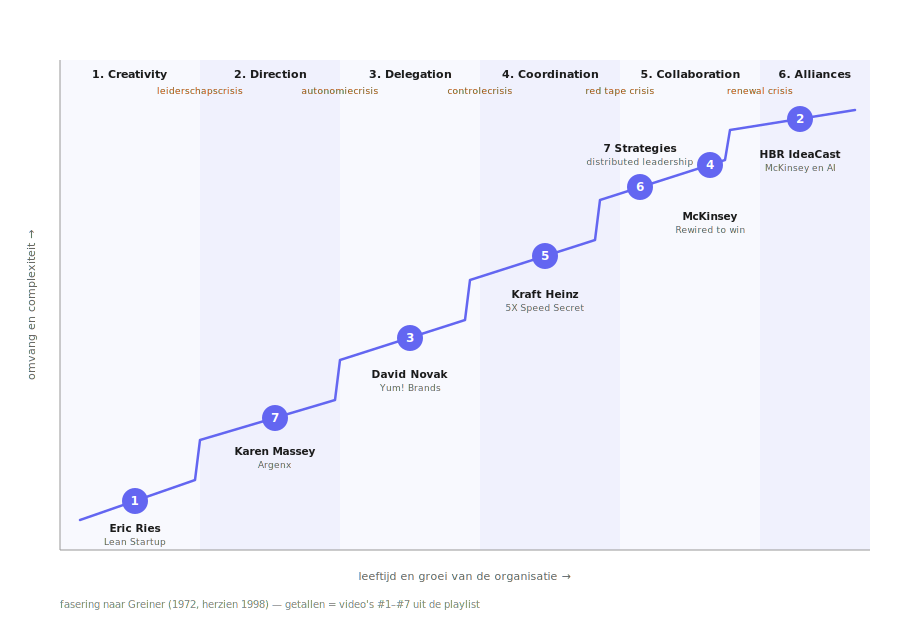

**Fase 1 — Creativity (en de leiderschapscrisis)**

*Eric Ries — "How to build a company that withstands any era"* ([PoJ1vTdHpks](https://www.youtube.com/watch?v=PoJ1vTdHpks))
De auteur van *The Lean Startup* over hoe je een onderneming bouwt op gevalideerd leren en build-measure-learn, zodat ze meerdere eeuwen technologie en disruptie overleeft. Dit is precies de fase waarin een onderneming nog draait op ondernemerspassie en informele communicatie — Ries' boodschap is dat je deze startup-modus moet *institutionaliseren* als continue mechaniek, anders loop je vast op de leiderschapscrisis die Greiner aan het einde van fase 1 plaatst.

**Fase 2 — Direction (en de autonomiecrisis)**

*Karen Massey (Argenx) — "Leaders at All Levels"* ([eqpSydz-yao](https://www.youtube.com/watch?v=eqpSydz-yao))
Argenx — meer dan $40 miljard marktwaarde, $4 miljard omzet, minder dan 2.000 medewerkers — is een schoolvoorbeeld van een snel groeiend bedrijf dat de typische verstarring weet te vermijden. Massey beschrijft hoe ze structuur invoeren (Vision 2030, OGSM, kwartaalrituals) zónder hiërarchie, en hoe "indication teams" als mini-biotechs werken. Dit is fase 2 met opzet ontworpen om de autonomiecrisis vóór te zijn: richting geven en focus aanbrengen, zonder de zelfsturing van het team te smoren.

**Fase 3 — Delegation (en de controlecrisis)**

*David Novak — The McKinsey Podcast met Eric Kutcher* ([swN16yQYkTM](https://www.youtube.com/watch?v=swN16yQYkTM))
De oprichter van Yum! Brands vertelt over leiderschap in een gedecentraliseerd, franchise-gedreven model. Twee verhalen vatten de fase samen: Crystal Pepsi laat zien wat er misgaat als HQ niet luistert naar de bottlers/franchisees ("I was the smartest guy in the room and I was not"), en het Billy Ball-buffetverhaal in Clinton, Arkansas laat zien dat de échte wijsheid bij de frontlinie zit. Dit is delegatie volwassen geworden: leren leunen op zelfstandige eenheden zonder de controle te verliezen.

**Fase 4 — Coordination (en de red tape crisis)**

*Carolina Wosiack (Kraft Heinz) — "Leaders at All Levels: 5X Speed Secret"* ([TekZ8P6Gd8s](https://www.youtube.com/watch?v=TekZ8P6Gd8s))
Een wereldwijde foodgigant die tussen idee en marktintroductie 36 maanden zat — typisch coördinatiefase, vol staf-functies en goedkeuringsstappen. Wosiack vertelt hoe ze die cyclus naar 6 maanden terugbrachten door systemen te fixen in plaats van mensen te beschuldigen. Dit is de klassieke red-tape-crisis aan het einde van fase 4 — en de doorbraak die de overgang naar fase 5 mogelijk maakt.

**Fase 5 — Collaboration (en de groeicrisis)**

*Kate Isaacs & Michele Zanini — "Leaders at All Levels: 7 Strategies to Give Your Team Real Power"* ([rq5BefIKxDo](https://www.youtube.com/watch?v=rq5BefIKxDo))
De best-of compilatie met inzichten van Gore, GE Appliances, Bayer, Fidelity en Cascade Engineering. Distributed leadership is hier letterlijk het operating model van fase 5: matrix, teams, peer-to-peer-coördinatie en gedeeld eigenaarschap in plaats van hiërarchische besluitvorming. Dit is hoe collaboratie er praktisch uitziet.

*Rob Levin & Kate Smaje (McKinsey Live) — "Rewired to win"* ([EKoshVYmMBw](https://www.youtube.com/live/EKoshVYmMBw))
Het McKinsey-receptenboek voor enterprise-transformatie met AI: focus, capabilities, talent, operating model, data en technologie tegelijk aanpakken. Dit is fase 5 op organisatieniveau — niet één losse team-interventie, maar het hele systeem herbedraden zodat het collaboratief én datagedreven kan opereren.

**Fase 6 — Alliances / Extra-organisationele renewal (en de identiteitscrisis)**

*HBR IdeaCast — "How McKinsey Plans to Survive AI (and Reinvent Consulting)"* ([hSpem_oGAf0](https://www.youtube.com/watch?v=hSpem_oGAf0))
Een hooggespecialiseerde, prestigieuze organisatie die haar eigen kernverdienmodel onder de loep moet nemen omdat AI het werk fundamenteel raakt. Dit is fase 6: de identiteitsvraag — wie zijn we nog, wat is onze rol in een ecosysteem dat zelf verandert — en hoe overleef je een tijdperk waarin je traditionele competitief voordeel onder druk staat.

---

**De storyline van de playlist**

Samen vertellen deze zeven video's één doorlopend verhaal over de levenscyclus van organisaties. Het begint bij **Ries**, die laat zien dat je vanaf dag één moet ontwerpen voor continue verandering. **Massey/Argenx** pakt vervolgens de schaalvraag op en bewijst dat je groei en innovatiekracht níet hoeft in te leveren — mits je hiërarchie en structuur leert onderscheiden. **Novak** brengt het drama van het midden van de cyclus: de spanning tussen centraal aansturen en frontline-wijsheid loslaten, met Crystal Pepsi als waarschuwing en Billy Ball als belofte. Bij **Kraft Heinz** zien we wat er gebeurt als die spanning niet wordt opgelost en de organisatie verstart in 36-maanden cycli — én hoe je daar weer uit komt. De **"7 Strategies"-compilatie** en **McKinsey "Rewired to win"** laten samen zien hoe fase 5 er op micro- en macroniveau uitziet: gedistribueerd leiderschap binnen teams, en een herbedraad operating model voor het hele bedrijf. En **HBR IdeaCast over McKinsey zelf** sluit de cirkel: ook de meest gevestigde, succesvolle organisaties moeten in het AI-tijdperk hun identiteit opnieuw bevragen.

De rode draad — door alle zeven heen — is een dubbele beweging: AI fungeert als de externe schok die elke fase forceert tot herontwerp, en *distributed leadership* + *curiosity* zijn de interne mechaniek waarmee organisaties die fasen telkens opnieuw kunnen doorlopen zonder zichzelf te verliezen. Met andere woorden: Greiner's groeicurve is geen ladder die je beklimt, maar een patroon dat zich herhaalt — en de bedrijven die dat begrijpen, bouwen die hercyclering al ván begin af aan in plaats van er pas op te reageren als de crisis er staat.

Hierboven zie je de zeven video's elk op hun eigen fase van de Greiner-curve. De stippellijn-achtige stapjes tussen de fasen zijn de crises die Greiner identificeert — leiderschap → autonomie → controle → red tape → renewal — en elke video laat zien hoe een organisatie ofwel ín die crisis vastloopt, ofwel er bewust uit ontsnapt.

Wat opvalt als je het zo ziet: drie van de zeven video's clusteren in fase 5 en 6, en dat is ook precies waar het meeste transformatieadvies in 2026 zich op richt — grote, gevestigde organisaties die hun coordinatie- en aristocratie-reflexen moeten afleren om in de AI-eeuw relevant te blijven. De videos #1 (Ries) en #7 (Argenx) zijn de tegenhanger: zij laten zien dat je het patroon van crises kunt vóórzijn als je vanaf het begin ontwerpt voor leren en zelfsturing, in plaats van dat pas in te bouwen wanneer de organisatie er al onder lijdt.

Wil je dat ik dit overzicht ook als PNG of PDF wegzet zodat je het in een presentatie of handout kunt gebruiken? Of een variant maken waarin per fase een korte didactische vraag staat voor studenten?

Sources:
- [Eric Ries — How to build a company that withstands any era](https://www.youtube.com/watch?v=PoJ1vTdHpks)
- [Karen Massey (Argenx) — Leaders at All Levels](https://www.youtube.com/watch?v=eqpSydz-yao)
- [David Novak — The McKinsey Podcast](https://www.youtube.com/watch?v=swN16yQYkTM)
- [Carolina Wosiack (Kraft Heinz) — 5X Speed Secret](https://www.youtube.com/watch?v=TekZ8P6Gd8s)
- [Leaders at All Levels — 7 Strategies to Give Your Team Real Power](https://www.youtube.com/watch?v=rq5BefIKxDo)
- [McKinsey Live — Rewired to win](https://www.youtube.com/live/EKoshVYmMBw)
- [HBR IdeaCast — How McKinsey Plans to Survive AI](https://www.youtube.com/watch?v=hSpem_oGAf0)
